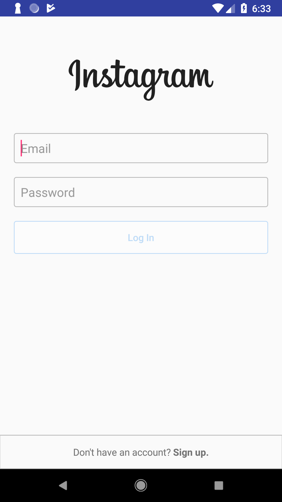
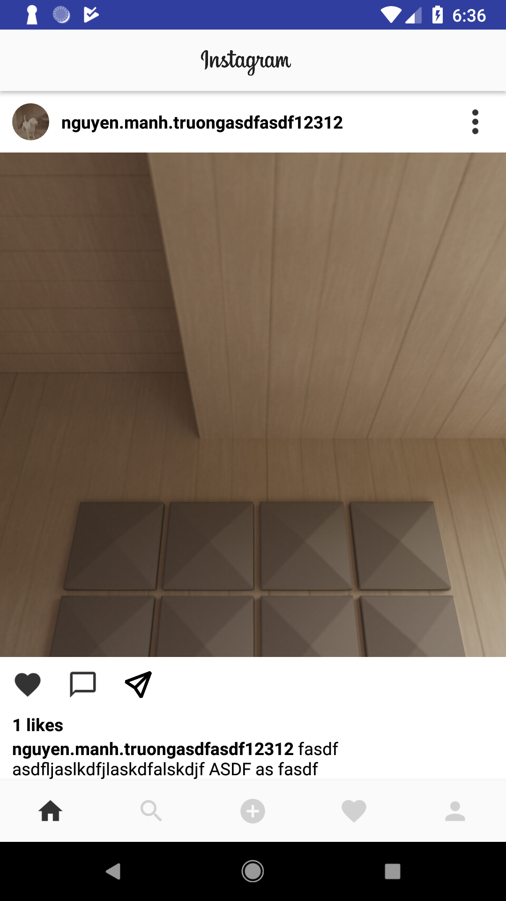
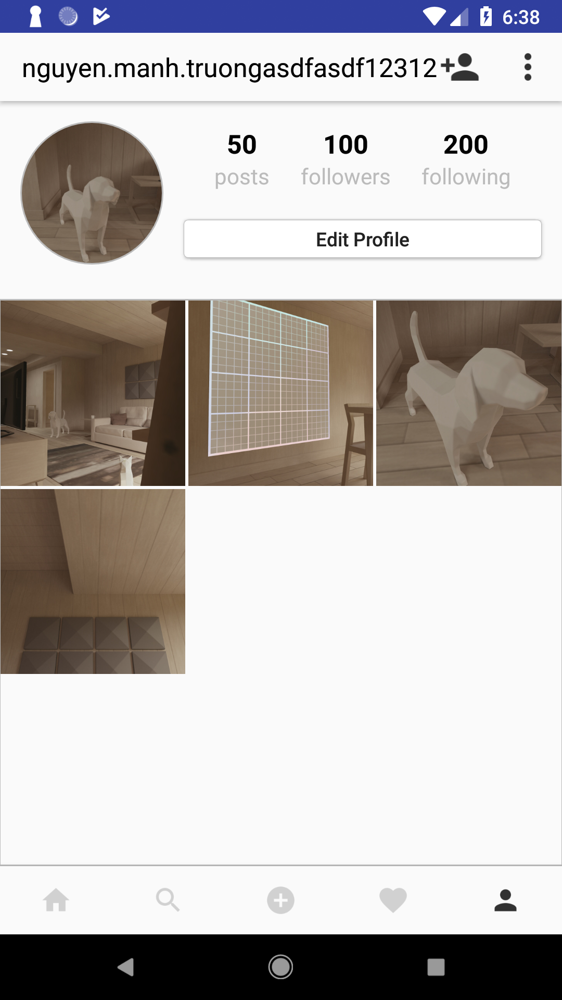
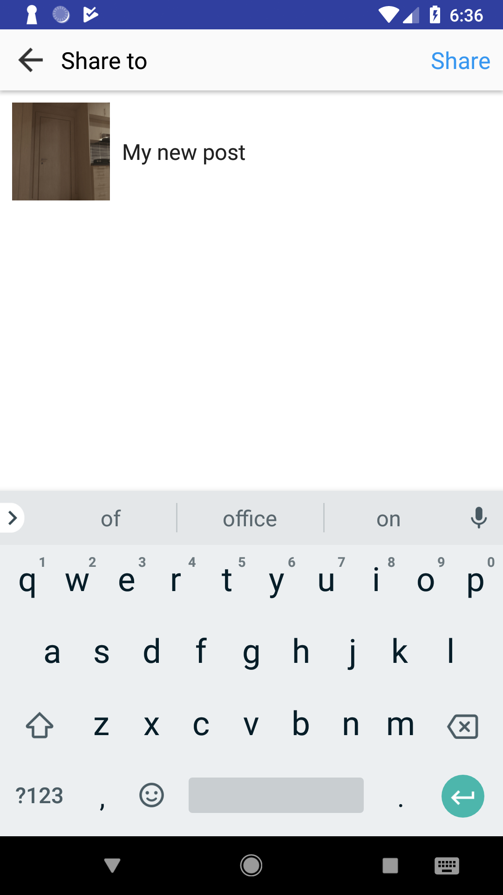
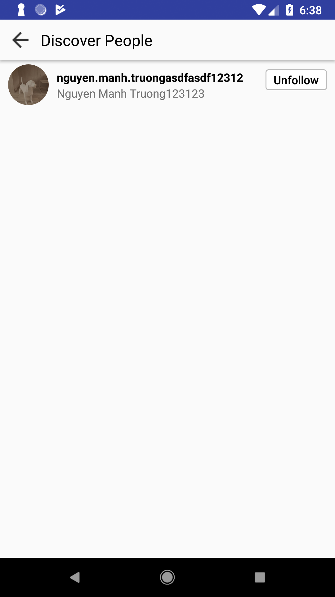

# Instagram Clone Kotlin

This application is an attempt to clone Instagram. You can login, post post, follow users, like post.

## What our application looks like ?

  
  
  
  
  

## Built with

- Kotlin
- Firebase

## License
This project is licensed under the terms of the MIT license.

